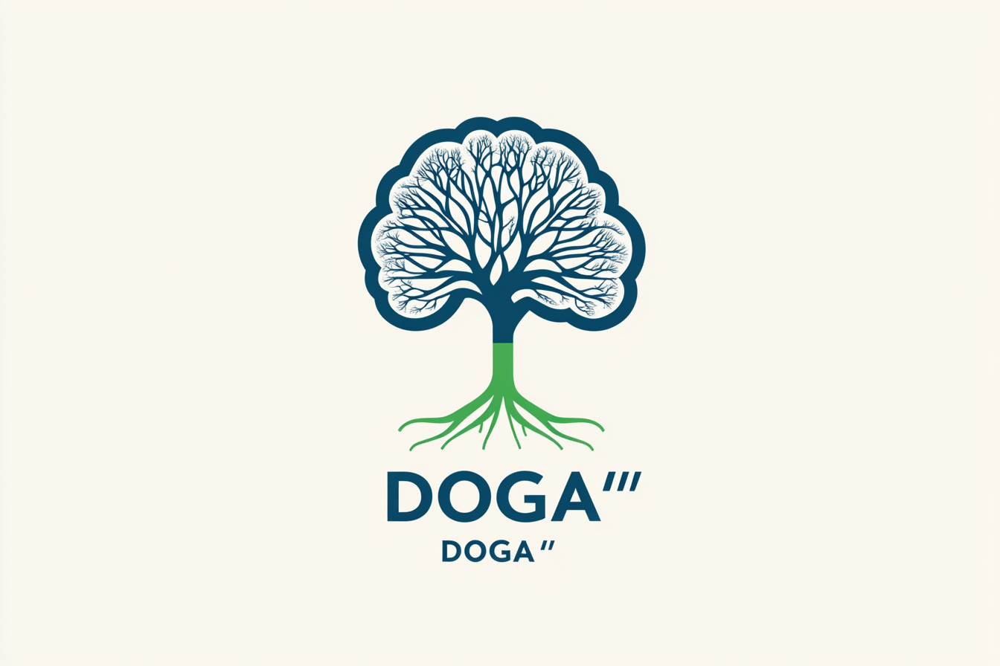

# DOGA

[](https://github.com/0z1-ghb/doga-hermes/blob/main/LICENSE)
[](https://github.com/0z1-ghb/doga-hermes)
[](https://github.com/0z1-ghb/doga-hermes/actions)
[](https://github.com/0z1-ghb/doga-hermes)
[](https://github.com/0z1-ghb/doga-hermes/releases)



**Capa de pensamiento probabilística y orientada a objetivos para Hermes Agent.**

DOGA (Doğa significa "naturaleza" en turco) añade simulación de escenarios, razonamiento Monte Carlo y detección de objetivos a las respuestas del LLM. Guía al modelo para que piense probabilísticamente antes de responder, sin modificar el comportamiento central de Hermes.

---

## Características

- **Detección de Objetivos** Identifica si el usuario necesita Información, Comprensión o Acción antes de responder.
- **Generación de Escenarios** Insta al LLM a enumerar y ponderar múltiples interpretaciones.
- **Simulación Monte Carlo** Motor en Python puro (10K–50K iteraciones) para análisis de probabilidad cuantitativa, utilizando 0 tokens del LLM.
- **Panel de Pensamiento** Los bloques de razonamiento `<world_model>` se extraen y muestran como un panel estructurado `[DOGA: Thinking Process]` antes de la respuesta final.
- **Profundidad Automática** Evaluación automática de la complejidad por consulta: decide entre baja/media/alta mediante análisis de cadenas en Python puro (0 tokens del LLM).
- **Profundidad Configurable** 5 niveles (1 = verificación de objetivos ligera, 5 = razonamiento probabilístico completo con guía de herramientas de simulación).
- **Integración de Memoria (opcional)** Recuerda patrones de objetivos entre sesiones a través de Mnemosyne (`pip install doga-hermes[memory]`).
- **Sombreros de Pensamiento de De Bono** Razonamiento paralelo estructurado a través del lente de los Seis Sombreros de Pensamiento; sensible a la profundidad (Blanco, Negro, Amarillo, Verde, Rojo), opcional, habilitado por defecto.
- **Razonamiento Recursivo** Herramienta `reason_deeper` para autocrítica multinivel; cada nivel de recursión utiliza un lente de sombrero de De Bono diferente; salida de panel jerárquica.
- **Seguridad de Corte Forzado (Hard-Break)** Detención automática tras 3 llamadas ignoradas a `reason_deeper` para evitar el agotamiento por bucles de herramientas.

---

## Instalación

Copia el directorio `doga/` en tu carpeta de plugins de Hermes:

```bash
cp -r doga ~/.hermes/plugins/doga
```

Para la persistencia de la memoria de objetivos entre sesiones (opcional):

```bash
pip install doga-hermes[memory]
```

No se requieren cambios de configuración; DOGA detecta automáticamente Mnemosyne en tiempo de ejecución.

Luego, habilítalo en `~/.hermes/config.yaml`:

```yaml
plugins:
  enabled: [doga]

toolsets: [hermes-cli, doga]

doga:
  depth: 3
  show_simulation: true
  max_scenarios: 5
```

---

## Uso

### Comandos de Barra (Slash Commands)

| Comando | Descripción |
|---------|-------------|
| `/doga on` | Habilitar DOGA |
| `/doga off` | Deshabilitar DOGA |
| `/doga status` | Mostrar ajustes actuales |
| `/doga auto` | Profundidad automática: decide baja/media/alta por consulta (por defecto) |
| `/doga manual low\|medium\|high` | Forzar un nivel de pensamiento específico |
| `/doga depth <1-5>` | Establecer profundidad de pensamiento (cambia a modo manual) |
| `/doga hats on` | Habilitar sombreros de pensamiento paralelo de De Bono (por defecto) |
| `/doga hats off` | Deshabilitar sombreros de De Bono (vuelve a los prompts estándar de objetivo/escenario) |
| `/doga show` | Mostrar panel de simulación |
| `/doga hide` | Ocultar panel de simulación |
| `/doga memory on` | Habilitar memoria de objetivos (requiere Mnemosyne) |
| `/doga memory off` | Deshabilitar memoria de objetivos |
| `/doga max_recursion <1-5>` | Profundidad máxima de recursión para la herramienta `reason_deeper` (por defecto: 3) |

### Herramienta Simulate

Se registra una herramienta `simulate` en el conjunto de herramientas `doga` para análisis Monte Carlo. El LLM puede llamarla cuando se requiera una ponderación de probabilidad cuantitativa:

```json
{
  "scenarios": [
    {
      "name": "contract_valid",
      "variables": {"signature_authorized": 0.8, "no_duress": 0.95},
      "conditions": ["signature_authorized and no_duress"]
    }
  ],
  "n_iterations": 10000
}
```

Devuelve la distribución de probabilidad, la entropía y el nivel de incertidumbre. Los escenarios pueden incluir `children` anidados para simulaciones secundarias jerárquicas.

### Herramienta Reason Deeper

Se registra una herramienta `reason_deeper` para la autocrítica recursiva. El LLM la llama después del análisis inicial de `<world_model>` para identificar aspectos omitidos:

```json
{
  "focus": "black hat risk cascade"
}
```

Cada nivel de recursión aplica un lente de pensamiento de De Bono diferente. La herramienta devuelve una instrucción estructurada para un análisis más profundo. Una vez alcanzada la profundidad `max_recursion`, DOGA devuelve una señal de parada; si el LLM la ignora 3 veces, un corte forzado termina el bucle.

---

## Hoja de Ruta (Roadmap)

- **Fase 1 (completada)** — Memoria opcional de Mnemosyne para la persistencia de patrones de objetivos.
- **Fase 2 (completada)** — Selección automática de profundidad basada en la complejidad de la consulta.
- **Sombreros de De Bono (completada)** — Razonamiento estructurado de los Seis Sombreros de Pensamiento, opcional, sensible a la profundidad.
- **Fase 3 (completada)** — Razonamiento recursivo con simulación de escenarios anidados, herramienta `reason_deeper`.

---

## Arquitectura

DOGA utiliza tres ganchos (hooks) de plugins de Hermes:

| Gancho | Propósito |
|------|---------|
| `pre_llm_call` | Inyecta la detección de objetivos + guía de escenarios en el prompt |
| `transform_llm_output` | Extrae los bloques `<world_model>`, los formatea como panel de pensamiento |
| `post_tool_call` | Registra el uso de herramientas; rastrea la profundidad y la pila de recursión de `reason_deeper` |

No se modifican archivos centrales de Hermes; DOGA es un plugin puro.

---

## Licencia

MIT
